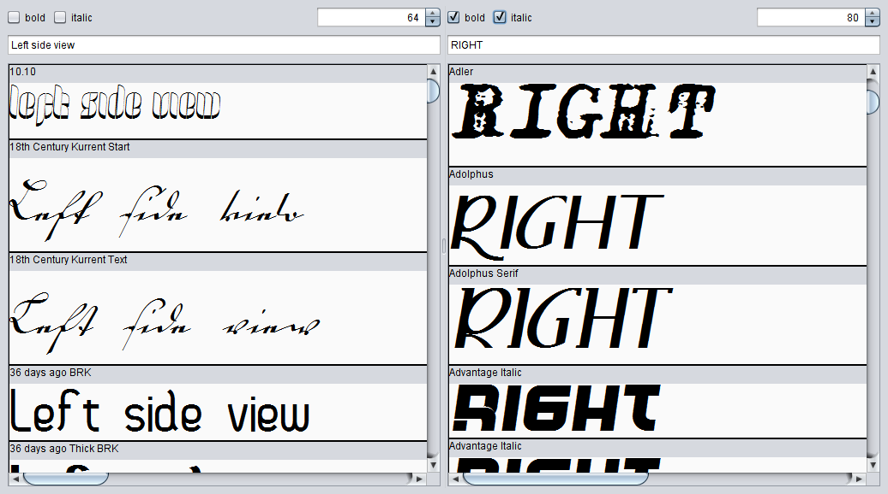

# Fontviewer

This is a simple application to view and compare multiple fonts in two different window panes.  
It's created to get a quick overview of the installed fonts.



## Build & Run
The code is compatible with JDK 8 up to JDK 15.

### Gradle
```
gradle clean build
java -jar build/libs/fontviewer-1.0.0.jar
```

### Maven
```
mvn clean package
java -jar target/fontviewer-1.0.0.jar
```
